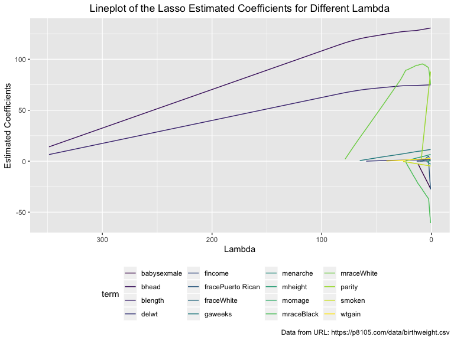
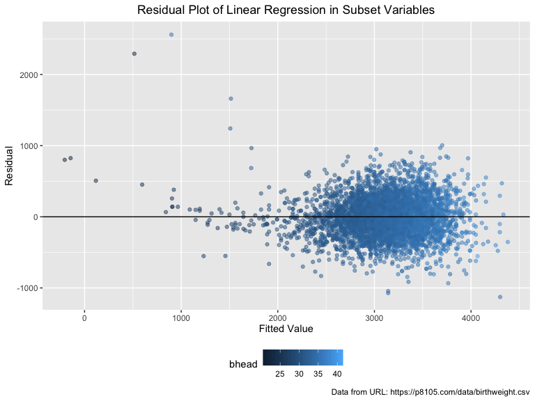
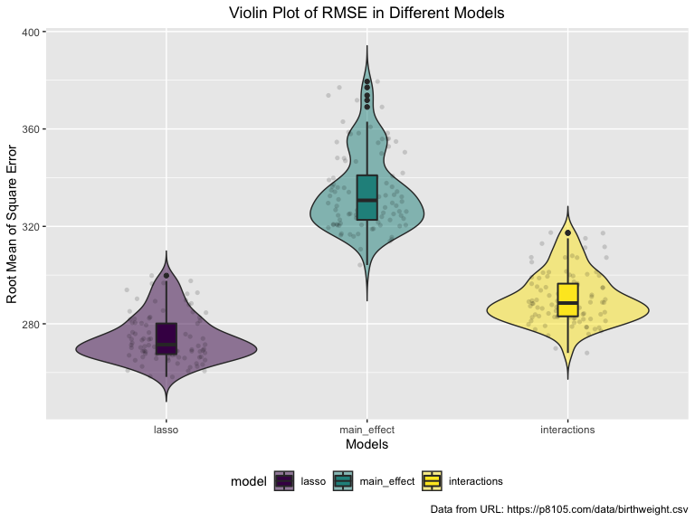

p8105\_hw6\_jz3183
================
Jungang Zou
11/14/2019

# Homework 6 for Data Science Course p8105

## Problem 1

First, we read the data from the local file.

``` r
# in this code chunk, we read the data from local files and display
df_birthweight = 
  read_csv("./problem1_data/birthweight.csv") %>% 
  janitor::clean_names() %>% 
  print()
## # A tibble: 4,342 x 20
##    babysex bhead blength   bwt delwt fincome frace gaweeks malform menarche
##      <dbl> <dbl>   <dbl> <dbl> <dbl>   <dbl> <dbl>   <dbl>   <dbl>    <dbl>
##  1       2    34      51  3629   177      35     1    39.9       0       13
##  2       1    34      48  3062   156      65     2    25.9       0       14
##  3       2    36      50  3345   148      85     1    39.9       0       12
##  4       1    34      52  3062   157      55     1    40         0       14
##  5       2    34      52  3374   156       5     1    41.6       0       13
##  6       1    33      52  3374   129      55     1    40.7       0       12
##  7       2    33      46  2523   126      96     2    40.3       0       14
##  8       2    33      49  2778   140       5     1    37.4       0       12
##  9       1    36      52  3515   146      85     1    40.3       0       11
## 10       1    33      50  3459   169      75     2    40.7       0       12
## # … with 4,332 more rows, and 10 more variables: mheight <dbl>,
## #   momage <dbl>, mrace <dbl>, parity <dbl>, pnumlbw <dbl>, pnumsga <dbl>,
## #   ppbmi <dbl>, ppwt <dbl>, smoken <dbl>, wtgain <dbl>
```

After reading the data, I will tidy the data.

For the missing value, there are totally 0 missing values in the data.

For variable type, I tidy the data according to the data description:

  - babysex: baby’s sex (male = 1, female = 2)
  - bhead: baby’s head circumference at birth (centimeters)
  - blength: baby’s length at birth (centimeteres)
  - bwt: baby’s birth weight (grams)
  - delwt: mother’s weight at delivery (pounds)
  - fincome: family monthly income (in hundreds, rounded)
  - frace: father’s race (1 = White, 2 = Black, 3 = Asian, 4 = Puerto
    Rican, 8 = Other, 9 = Unknown)
  - gaweeks: gestational age in weeks
  - malform: presence of malformations that could affect weight (0 =
    absent, 1 = present)
  - menarche: mother’s age at menarche (years)
  - mheigth: mother’s height (inches)
  - momage: mother’s age at delivery (years)
  - mrace: mother’s race (1 = White, 2 = Black, 3 = Asian, 4 = Puerto
    Rican, 8 = Other)
  - parity: number of live births prior to this pregnancy
  - pnumlbw: previous number of low birth weight babies
  - pnumgsa: number of prior small for gestational age babies
  - ppbmi: mother’s pre-pregnancy BMI
  - ppwt: mother’s pre-pregnancy weight (pounds)
  - smoken: average number of cigarettes smoked per day during pregnancy
  - wtgain: mother’s weight gain during pregnancy (pounds)

<!-- end list -->

``` r
# in this code chunk, we will change the variable type.
df_tidy_birthweight =
  df_birthweight %>% 
  mutate(
    babysex = as.factor(case_when(
       babysex == 1 ~ "male",
       babysex == 2 ~ "female",
    )),
    frace = as.factor(case_when(
      frace == 1 ~ "White",
      frace == 2 ~ "Black",
      frace == 3 ~ "Asian",
      frace == 4 ~ "Puerto Rican",
      frace == 8 ~ "Other",
      frace == 9 ~ "Unknown",
    )),
    malform = as.factor(case_when(
      malform == 0 ~ "absent",
      malform == 1 ~ "present"
    )),
    mrace = as.factor(case_when(
      mrace == 1 ~ "White",
      mrace == 2 ~ "Black",
      mrace == 3 ~ "Asian",
      mrace == 4 ~ "Puerto Rican",
      mrace == 8 ~ "Other",
    ))
  )

#display
df_tidy_birthweight
## # A tibble: 4,342 x 20
##    babysex bhead blength   bwt delwt fincome frace gaweeks malform menarche
##    <fct>   <dbl>   <dbl> <dbl> <dbl>   <dbl> <fct>   <dbl> <fct>      <dbl>
##  1 female     34      51  3629   177      35 White    39.9 absent        13
##  2 male       34      48  3062   156      65 Black    25.9 absent        14
##  3 female     36      50  3345   148      85 White    39.9 absent        12
##  4 male       34      52  3062   157      55 White    40   absent        14
##  5 female     34      52  3374   156       5 White    41.6 absent        13
##  6 male       33      52  3374   129      55 White    40.7 absent        12
##  7 female     33      46  2523   126      96 Black    40.3 absent        14
##  8 female     33      49  2778   140       5 White    37.4 absent        12
##  9 male       36      52  3515   146      85 White    40.3 absent        11
## 10 male       33      50  3459   169      75 Black    40.7 absent        12
## # … with 4,332 more rows, and 10 more variables: mheight <dbl>,
## #   momage <dbl>, mrace <fct>, parity <dbl>, pnumlbw <dbl>, pnumsga <dbl>,
## #   ppbmi <dbl>, ppwt <dbl>, smoken <dbl>, wtgain <dbl>
```

After change the variable type, we need to check if there is error
points in data, so I check the structure of the tidied data as follows:

    ##    babysex         bhead          blength           bwt      
    ##  female:2112   Min.   :21.00   Min.   :20.00   Min.   : 595  
    ##  male  :2230   1st Qu.:33.00   1st Qu.:48.00   1st Qu.:2807  
    ##                Median :34.00   Median :50.00   Median :3132  
    ##                Mean   :33.65   Mean   :49.75   Mean   :3114  
    ##                3rd Qu.:35.00   3rd Qu.:51.00   3rd Qu.:3459  
    ##                Max.   :41.00   Max.   :63.00   Max.   :4791  
    ##      delwt          fincome               frace         gaweeks     
    ##  Min.   : 86.0   Min.   : 0.00   Asian       :  46   Min.   :17.70  
    ##  1st Qu.:131.0   1st Qu.:25.00   Black       :1911   1st Qu.:38.30  
    ##  Median :143.0   Median :35.00   Other       :  14   Median :39.90  
    ##  Mean   :145.6   Mean   :44.11   Puerto Rican: 248   Mean   :39.43  
    ##  3rd Qu.:157.0   3rd Qu.:65.00   White       :2123   3rd Qu.:41.10  
    ##  Max.   :334.0   Max.   :96.00                       Max.   :51.30  
    ##     malform        menarche        mheight          momage    
    ##  absent :4327   Min.   : 0.00   Min.   :48.00   Min.   :12.0  
    ##  present:  15   1st Qu.:12.00   1st Qu.:62.00   1st Qu.:18.0  
    ##                 Median :12.00   Median :63.00   Median :20.0  
    ##                 Mean   :12.51   Mean   :63.49   Mean   :20.3  
    ##                 3rd Qu.:13.00   3rd Qu.:65.00   3rd Qu.:22.0  
    ##                 Max.   :19.00   Max.   :77.00   Max.   :44.0  
    ##           mrace          parity            pnumlbw     pnumsga 
    ##  Asian       :  43   Min.   :0.000000   Min.   :0   Min.   :0  
    ##  Black       :1909   1st Qu.:0.000000   1st Qu.:0   1st Qu.:0  
    ##  Puerto Rican: 243   Median :0.000000   Median :0   Median :0  
    ##  White       :2147   Mean   :0.002303   Mean   :0   Mean   :0  
    ##                      3rd Qu.:0.000000   3rd Qu.:0   3rd Qu.:0  
    ##                      Max.   :6.000000   Max.   :0   Max.   :0  
    ##      ppbmi            ppwt           smoken           wtgain      
    ##  Min.   :13.07   Min.   : 70.0   Min.   : 0.000   Min.   :-46.00  
    ##  1st Qu.:19.53   1st Qu.:110.0   1st Qu.: 0.000   1st Qu.: 15.00  
    ##  Median :21.03   Median :120.0   Median : 0.000   Median : 22.00  
    ##  Mean   :21.57   Mean   :123.5   Mean   : 4.145   Mean   : 22.08  
    ##  3rd Qu.:22.91   3rd Qu.:134.0   3rd Qu.: 5.000   3rd Qu.: 28.00  
    ##  Max.   :46.10   Max.   :287.0   Max.   :60.000   Max.   : 89.00

With the table, we find the factor variables are consistent with the
description. In addition, we find the values of variables “pnumlbw” and
“pnumsga” are 0 for all the observations.

Since we know just little knowledges, so we cannot use a hypothesized
structure for the factors that underly birthweight. In statistical
learning, there is a variant of linear regression that is “Lasso”, which
is a data-driven models, and is robust to some “unuseful” variables.
Since lasso make a L1-constraint on the coefficients, it can shrink the
unstable variables to 0 and make the model robust and easy to interpret.

First, lasso has a parameter \(\lambda\) that control the size of
shrinkage, and we need to specify this parameter. we first draw a plot
about the profiles of lasso coefficients by tuning the parameter
\(\lambda\), and use mean of square error as the cost
function:



From the graph, we may find the estimated coefficients of variabls
“bhead”, “blength” have the greatest positive impact on the babyweight
as lambda changes. And also, the variable “mraceWhite” also has a little
negative impact on the babyweight. On the other hand, when lambda is
large, other variables are close to 0, which means they are not robust
to the regression, and are not as useful as “bhead”, “blength”. In the
later process, we will carefully delete these variables in regression
models based on cross validation.

To carefully choose the parameter lambda, we use cross validation to
choose this value.

``` r
# in this code chunk, we use cv to select the parameter of lasso

# calculate the best lambda
lambda_best = 
  glmnet::cv.glmnet(x = x_process(df_tidy_birthweight), y = y_process(df_tidy_birthweight), alpha = 1, nfolds = 100)

# display the result
lambda_best
```

    ## 
    ## Call:  glmnet::cv.glmnet(x = x_process(df_tidy_birthweight), y = y_process(df_tidy_birthweight),      nfolds = 100, alpha = 1) 
    ## 
    ## Measure: Mean-Squared Error 
    ## 
    ##     Lambda Measure   SE Nonzero
    ## min  0.993   74733 2785      15
    ## 1se 21.390   77298 2760       9

From the result, we choose lambda = 0.9928296 as the best parameter, and
we have successfully built the regression for this data.

``` r
# in this code chunk, we calculate the coefficients of lasso.

lambda = lambda_best$lambda.min

lasso_best_fit = 
  glmnet::glmnet(x = x_process(df_tidy_birthweight), y = y_process(df_tidy_birthweight), alpha = 1, nlambda = 1, lambda = lambda) #alpha is the parameters to control the type of elastic net models, when alpha = 1, the elastic net model is equivalent to lasso.

# display the parameters
glmnet::coef.glmnet(lasso_best_fit) 
```

    ## 26 x 1 sparse Matrix of class "dgCMatrix"
    ##                              s0
    ## (Intercept)       -6087.8487728
    ## (Intercept)           .        
    ## babysexmale         -26.5204901
    ## bhead               130.5952201
    ## blength              74.8803965
    ## delwt                 1.3830819
    ## fincome               0.2711749
    ## fraceBlack            .        
    ## fraceOther            .        
    ## fracePuerto Rican   -31.7121786
    ## fraceWhite            .        
    ## gaweeks              11.3910990
    ## malformpresent        .        
    ## menarche             -2.8197732
    ## mheight               6.5307597
    ## momage                0.5449479
    ## mraceBlack          -65.9578722
    ## mracePuerto Rican     .        
    ## mraceWhite           70.2605679
    ## parity               85.5698831
    ## pnumlbw               .        
    ## pnumsga               .        
    ## ppbmi                 .        
    ## ppwt                  .        
    ## smoken               -4.6769404
    ## wtgain                2.6406091

From this model, we find the variables “fraceBlack”, “fraceOther”,
“fraceWhite”, “malformpresent”, “mracePuerto Rican”, “pnumlbw”,
“pnumsga”, “ppbmi”, “ppwt” have shrink to 0, which means these
variables have no effect to predict babyweight.

On the other hand, variables “bhead”, “blength”, “mraceWhite”, “parity”
have show strong positive effect on babyweight, which means the larger
these continous variables hold, the larger babyweight is. Also, if baby
mother is white, the babyweight is more likely to be greater. What\`s
more, variables “babysexmale”, “fracePuerto Rican”, “mraceBlack” have
show strong negative effect on babyweight, which means if the baby is
male or father is Puerto Rican or mother is black, the babyweight is
more likely to be lower. Other variables not mentioned show little
effect on the babyweight.

After the regression interpretation, we make the prediction to fitted
value and residuals. Also, since functions add\_predictions and
add\_residuals are not consistent with Lasso model, I use the function
glmnet::predict.glmnet to predict the fitted value.

``` r
# in this code chunk, we use lasso to predict

# calculate the prediction
# since functions add_predictions and add_residuals are not consistent with Lasso model, I use the function glmnet::predict.glmnet to predict the fitted value
prediction = glmnet::predict.glmnet(lasso_best_fit, x_process(df_tidy_birthweight), type = "response")

# calculate the residual
df_tidy_lass = 
  df_tidy_birthweight %>% 
  
  mutate(
    lasso_prediction = prediction,
    lasso_residual = pull(., bwt) - lasso_prediction
    )

# residual plot
df_tidy_lass %>% 
  ggplot(aes(x = lasso_prediction, y = lasso_residual, color = bhead)) +
  geom_point(alpha = 0.5) +
  labs(
    title = "Residual Plot of Lasso for Lambda = 0.993",
    x = "Fitted Value",
    y = "Residual",
    caption = "Data from URL: https://p8105.com/data/birthweight.csv") +
  geom_hline(aes(yintercept = 0), color = "black") +
  theme(plot.title = element_text(hjust = 0.5))
```


From the residual plot, we find most of the residual are distributed on
the two sides of the 0-axis. Also, we find few outliers when fitted
value is low with low value of “bhead”.

To show the usage of functions add\_predictions and add\_residuals, I
also use the “useful” variables discussed above (babysex, bhead,
blength, frace, mrace, parity), to fit a linear regression and plot the
residual against fitted
values.

``` r
# in this code chunk, I use the the "useful" variables (babysex, bhead, blength, frace, mrace, parity) to make a regression to show the usage of functions add_predictions and add_residuals.

# fit the linear regression
fit = lm(bwt ~ babysex + bhead + blength + frace + mrace+ parity, data = df_tidy_birthweight)

# make the residual plot and use functions add_predictions and add_residuals.
df_tidy_birthweight %>% 
  mutate(
    residual = pull(modelr::add_residuals(., fit), resid),
    fitted_values = pull(modelr::add_predictions(., fit), pred)) %>% 
  ggplot(aes(x = fitted_values, y = residual, color = bhead)) +
  geom_point(alpha = 0.5) +
  labs(
    title = "Residual Plot of Linear Regression in Subset Variables",
    x = "Fitted Value",
    y = "Residual",
    caption = "Data from URL: https://p8105.com/data/birthweight.csv") +
  geom_hline(aes(yintercept = 0), color = "black") +
  theme(plot.title = element_text(hjust = 0.5))
```



From the residual plot of linear regression, we may find the plot looks
like the residual plot of Lasso, since these 2 models use the same
variable to fit the regression.

Then, I will use cross validation to compare the lasso regression with
the following 2 models:

  - One using length at birth and gestational age as predictors (main
    effects only)
  - One using head circumference, length, sex, and all interactions
    (including the three-way interaction) between these

<!-- end list -->

``` r
# in this code chunk, we need to use cv to make comparisons.

# fit the lasso regression and return the model
lasso_function = function(data){
  lambda_best = glmnet::cv.glmnet(x = x_process(data), y = y_process(data), alpha = 1, nfolds = 100) #cv to find best lambda
  lambda = lambda_best$lambda.min #best lambda
  lasso_best_fit = glmnet::glmnet(x = x_process(data), y = y_process(data), alpha = 1, nlambda = 1, lambda = lambda) #fit the lasso model
  lasso_best_fit
}

# since functions rmse is not consistent with Lasso model, I write the function to caculate the rmse of lasso
lasso_rmse = function(model, data) 
{
  fitted_y = glmnet::predict.glmnet(model, x_process(data), type = "response") # calculate the fitted value
  residuals = data$bwt - fitted_y     # calculate the residuals
  sqrt(mean(residuals^2, na.rm = TRUE))      # calculate the rmse
}


# create the cv data
cv_df =
  crossv_mc(df_tidy_birthweight, 100) %>% 
  mutate(
    train = map(train, as_tibble),
    test = map(test, as_tibble))

# calculate rmse of each models by cv
cv_df = 
  cv_df %>% 
  mutate( # create the models
    lasso_mod = map(train, ~lasso_function(.x)),
    main_effect_mod  = map(train, ~lm(bwt ~ blength + gaweeks, data = .x)),
    interactions_mod = map(train, ~lm(bwt ~ bhead * blength + bhead * babysex + babysex * blength + bhead * babysex * blength, data = .x))
  ) %>% 
  mutate( # calculate the rmse
    rmse_lasso = map2_dbl(lasso_mod, test, ~lasso_rmse(model = .x, data = .y)),
    rmse_main_effect  = map2_dbl(main_effect_mod, test, ~rmse(model = .x, data = .y)),
    rmse_interactions = map2_dbl(interactions_mod, test, ~rmse(model = .x, data = .y))
  )

# display
cv_df
```

    ## # A tibble: 100 x 9
    ##    train test  .id   lasso_mod main_effect_mod interactions_mod rmse_lasso
    ##    <lis> <lis> <chr> <list>    <list>          <list>                <dbl>
    ##  1 <tib… <tib… 001   <elnet>   <lm>            <lm>                   288.
    ##  2 <tib… <tib… 002   <elnet>   <lm>            <lm>                   275.
    ##  3 <tib… <tib… 003   <elnet>   <lm>            <lm>                   289.
    ##  4 <tib… <tib… 004   <elnet>   <lm>            <lm>                   269.
    ##  5 <tib… <tib… 005   <elnet>   <lm>            <lm>                   280.
    ##  6 <tib… <tib… 006   <elnet>   <lm>            <lm>                   266.
    ##  7 <tib… <tib… 007   <elnet>   <lm>            <lm>                   271.
    ##  8 <tib… <tib… 008   <elnet>   <lm>            <lm>                   267.
    ##  9 <tib… <tib… 009   <elnet>   <lm>            <lm>                   269.
    ## 10 <tib… <tib… 010   <elnet>   <lm>            <lm>                   276.
    ## # … with 90 more rows, and 2 more variables: rmse_main_effect <dbl>,
    ## #   rmse_interactions <dbl>

After calculating the root mean of square error, we will make a violin
plot to show the distribution of
rmse.

``` r
# in this code chunk, we will make a violin plot to show the distribution of rmse

cv_df %>% 
  select(starts_with("rmse")) %>% 
  pivot_longer(
    everything(),
    names_to = "model", 
    values_to = "rmse",
    names_prefix = "rmse_") %>% 
  mutate(model = fct_inorder(model)) %>% 
  ggplot(aes(x = model, y = rmse, fill = model)) +
  geom_violin(trim = FALSE, alpha = 0.5) +
  geom_jitter(shape = 16, position = position_jitter(0.2), alpha = 0.15) + #add jitters
  geom_boxplot(width = 0.1, lwd = 0.7) + #add the boxplot
  labs(
    title = "Violin Plot of RMSE in Different Models",
    x = "Models",
    y = "Root Mean of Square Error",
    caption = "Data from URL: https://p8105.com/data/birthweight.csv") +
  theme(plot.title = element_text(hjust = 0.5))
```



From the violin plot, we can find the model using length at birth and
gestational age as predictors (main effects only) has the highest rmse,
which means it doesn\`t fit well for test set. And the model using head
circumference, length, sex, and all interactions has the second highest
rmse which is totally lower than that in model main effects only.
Finally, our model Lasso has the lowest rmse, which means it fitted the
test set better than other 2 models.
